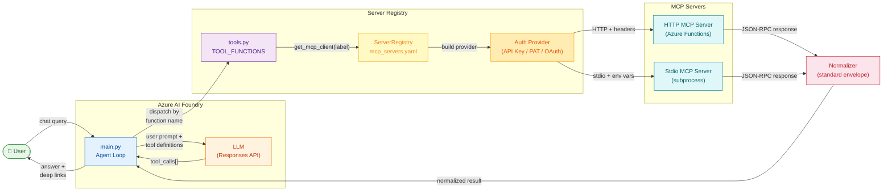

# azure-mcp-agent-starter

[](https://www.python.org/downloads/)
[](https://github.com/RajAnandakumar-Microsoft/azure-mcp-agent-starter/actions/workflows/tests.yml)
[](LICENSE)

A starter kit for building Azure AI Foundry agents that connect to **multiple MCP servers simultaneously** — with config-driven server registration, per-server authentication, and read-only safety enforcement built in.

Clone it, fill in your `.env`, and have a working multi-server agent running in under 10 minutes.

---

## What this kit gives you

| Feature | Description |
|---|---|
| Config-driven servers | Add/remove MCP servers by editing `mcp_servers.yaml` — no code changes |
| Per-server auth | API key, PAT, OAuth (MSAL), Azure Identity, or anonymous — declared per-server in YAML |
| Read-only guardrails | Registry blocks write-prefixed tool calls before they reach any server |
| Response normalization | Consistent envelope across heterogeneous MCP server responses |
| Startup credential validation | `validate_credentials()` checks all servers and reports missing/invalid creds at startup |
| Demo MCP server | Azure Functions app with JAMA + IcePanel fixture data to run locally |

---

## Architecture



The `ServerRegistry` reads `mcp_servers.yaml` at startup and wires up per-server authentication automatically. Add a new server by adding a YAML entry — no Python changes required.

---

## Quick start

> Full details in [QUICKSTART.md](QUICKSTART.md).

**Prerequisites:**

| Tool | Version | Why |
|---|---|---|
| Python | 3.10+ | Agent runtime |
| Azure CLI | latest | `az login` for Foundry auth |
| Node.js + [Azure Functions Core Tools](https://learn.microsoft.com/en-us/azure/azure-functions/functions-run-local) | 18+ / v4 | Run demo MCP server locally |
| Azure AI Foundry project | — | Deployed agent required |

**Steps:**

```bash
# 1. Clone and install
git clone https://github.com/RajAnandakumar-Microsoft/azure-mcp-agent-starter.git
cd azure-mcp-agent-starter/agent_app
pip install -r requirements.txt

# 2. Configure
cp .env.example .env
# fill in AZURE_EXISTING_AIPROJECT_ENDPOINT and AZURE_EXISTING_AGENT_ID

# 3. Log in
az login

# 4. Start the demo MCP server (separate terminal)
cd ../demo_mcp_server
func start --port 7070

# 5. Run the agent
python -m agent_app.main
```

Try asking:
- `show me authentication requirements`
- `what's related to REQ-001?`
- `find architecture components tagged with "API Gateway"`

---

## Adding your own MCP server (4 steps, no code)

> **Looking for servers to connect?** See [`MCP_SERVERS_DIRECTORY.md`](MCP_SERVERS_DIRECTORY.md) for
> 25+ official Microsoft MCP servers, plus Jama Connect, IcePanel, and community
> servers — each with ready-to-use `mcp_servers.yaml` configs.

**1.** Add an entry to `mcp_servers.yaml`:

```yaml
servers:
  - label: my_system
    description: "My system"
    transport: http
    url: "${MY_SYSTEM_URL:-http://localhost:7071/api}"
    auth:
      type: api_key
      header: "x-functions-key"
      env_var: MY_SYSTEM_KEY
    read_only: true
```

**2.** Add the variable to `.env`:
```
MY_SYSTEM_KEY=your-key
```

**3.** Add a tool in `agent_app/tools.py`:
```python
@ai_function
async def search_my_system(query: str) -> str:
    """Search my system for artifacts matching query."""
    client = get_mcp_client("my_system")
    return await client.call_tool("search", {"q": query})
```

**4.** Restart the agent. The new server is registered automatically.

See [examples/README.md](examples/README.md) for auth recipes, stdio servers, and response normalization.

---

## Authentication guide

The starter kit supports **6 auth types** out of the box. Each MCP server declares its own auth block in `mcp_servers.yaml`, so you can mix and match freely — one server with an API key, another with OAuth, a third with Azure Identity.

### `none` — Anonymous / local dev

```yaml
auth:
  type: none
```

No credentials. Use for local dev servers or MCP servers that accept anonymous access.

### `api_key` — HTTP header injection

```yaml
auth:
  type: api_key
  header: "x-functions-key"     # HTTP header name
  env_var: MY_FUNCTION_KEY      # Env var holding the key
```

Reads the key from the env var at startup and injects it as an HTTP header on every request. Typical for Azure Functions.

### `pat` — Personal Access Token

```yaml
auth:
  type: pat
  env_var: ADO_MCP_AUTH_TOKEN          # Env var holding the PAT
  stdio_auth_flag: "--authentication"  # Optional: CLI flag for stdio servers
  stdio_auth_value: "envvar"           # Optional: value for the flag
```

- **HTTP servers:** sends as `Authorization: Bearer <token>`.
- **stdio servers:** injects the env var into the subprocess environment, plus optional CLI flags.

### `oauth` — Delegated OAuth via MSAL

```yaml
# Confidential client (service-to-service, no user interaction)
auth:
  type: oauth
  tenant_id: "${AZURE_TENANT_ID}"
  client_id: "${GRAPH_CLIENT_ID}"
  scopes:
    - "https://graph.microsoft.com/.default"
  client_secret_env_var: GRAPH_CLIENT_SECRET

# Public client (interactive browser login — omit client_secret_env_var)
auth:
  type: oauth
  tenant_id: "${AZURE_TENANT_ID}"
  client_id: "${SP_CLIENT_ID}"
  scopes:
    - "https://graph.microsoft.com/Sites.Read.All"
```

Uses [MSAL](https://learn.microsoft.com/en-us/entra/identity-platform/msal-python) for token acquisition. Supports:
- **Confidential client** (with `client_secret_env_var`): client-credentials grant, no user interaction
- **Public client** (without secret): interactive browser login on first call, then silent token refresh

Requires: `pip install msal`

### `azure_identity` — DefaultAzureCredential

```yaml
auth:
  type: azure_identity
  scopes:
    - "https://management.azure.com/.default"
```

Uses [`DefaultAzureCredential`](https://learn.microsoft.com/en-us/python/api/azure-identity/azure.identity.defaultazurecredential) from the Azure Identity SDK. This is the **recommended auth type for Azure-native services** because:
- Works with `az login` locally
- Uses managed identity in deployed environments
- Handles token refresh automatically
- Requires no client secrets or PATs

Requires: `pip install azure-identity` (already in requirements.txt)

### Startup validation

Call `validate_credentials()` at startup to check all servers have valid auth configuration:

```python
from agent_app.registry.server_registry import init_registry

registry = init_registry("mcp_servers.yaml")
issues = registry.validate_credentials()
for label, problems in issues.items():
    for p in problems:
        print(f"⚠️  Server '{label}': {p}")
```

### Adding a custom auth type

1. Create a new provider class in `agent_app/auth/` implementing `get_headers()`, `get_env_vars()`, `get_stdio_args()`, and `validate()`
2. Add a case in `agent_app/auth/factory.py`
3. Export from `agent_app/auth/__init__.py`
4. Add tests in `agent_app/tests/test_auth_providers.py`

---

## Repository layout

```
azure-mcp-agent-starter/
├── .github/
│   └── copilot-instructions.md    # Copilot rules (single source of truth)
├── agent_app/                      # Main agent application
│   ├── auth/                       # AuthProvider protocol + 6 implementations
│   ├── registry/                   # Config-driven ServerRegistry
│   ├── normalization/              # Response envelope normalizer
│   ├── tests/                      # 100+ unit tests
│   ├── config.py                   # Environment loading & typed config
│   ├── main.py                     # Agent run loop (entry point)
│   ├── tools.py                    # Agent tool definitions
│   ├── mcp_client.py               # JSON-RPC 2.0 HTTP + stdio clients
│   └── mcp_utils.py                # Parallel MCP fetch utilities
├── demo_mcp_server/                # Azure Functions demo MCP server
│   ├── function_app.py             # MCP endpoint (JAMA + IcePanel demo data)
│   ├── demo_data.py                # Demo fixtures
│   └── mcp_response.py             # Standard response envelope helper
├── tests/                          # Integration tests (MCP protocol + endpoint)
├── examples/                       # Guides for extending the kit
│   ├── README.md                   # Extension guide
│   ├── auth_patterns.md            # Auth recipe examples
│   └── custom_http_server/README.md
├── mcp_servers.yaml                # Server registry (edit to add/remove servers)
├── MCP_SERVERS_DIRECTORY.md        # Catalog of available MCP servers to plug in
├── .env.example                    # Environment variable template
├── QUICKSTART.md                   # 10-minute setup guide
├── ruff.toml                       # Linter / formatter config
└── README.md                       # This file
```

---

## Running tests

```bash
pytest agent_app/tests/ -v
```

```bash
pytest tests/ -v          # MCP protocol + endpoint integration tests
```

---

## Key design decisions

| Decision | Choice | Rationale |
|---|---|---|
| Agent client | `AzureOpenAIResponsesClient` | Modern Responses API — preferred over Chat Completions |
| AI platform | Azure AI Foundry | Multi-provider models, project-scoped management |
| MCP host | Azure Functions | Simplest demo endpoint; Container Apps as fallback |
| Data layer | JSON fixtures | Start simple; migrate to Blob/Cosmos when volume requires it |
| Live APIs | Demo datasets only | Prevents real tenant dependencies in a starter kit |

---

## Contributing

See [CONTRIBUTING.md](CONTRIBUTING.md).

## License

[MIT](LICENSE)

